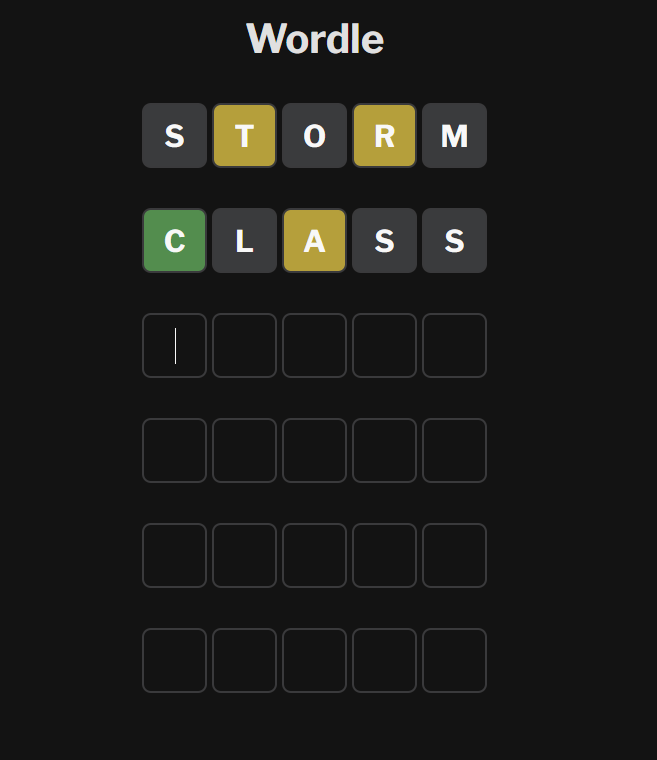

# Wordle App

A Wordle clone built using HTML, CSS, and JavaScript. This game allows users to guess a five-letter word within six attempts, with feedback provided after each guess. The app follows the same rules as the popular Wordle game.



A screenshot of the Wordle game in action.

## Features

- **User Interface**: Simple and intuitive UI with input fields for each letter in the word.
- **Color Feedback**: After each guess, the letters are highlighted with different colors to indicate correctness:
  - **Green**: Correct letter in the correct position.
  - **Yellow**: Correct letter in the wrong position.
  - **Gray**: Incorrect letter.

## Technologies Used

-  HTML, CSS, JavaScript

## Getting Started

### Prerequisites

- Web browser (Chrome, Firefox, Safari, etc.)

### Installation

1. Clone the repository:
   ```bash
   git clone https://github.com/SarthakT7/wordle.git
